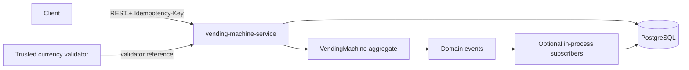

# Vending Machine System Design

This reviewer-facing summary records the accepted case architecture. Product rules are in [`assumptions.md`](assumptions.md); implementation status and run instructions are in the README.

## Requirement traceability

The original case requires DDD, domain events and event handling, a Spring Boot REST API with Swagger, persistence and consistency, monetary validation, error handling, recovery, and the supplied ten-product sample data. It does not require Kafka, an audit service, an outbox, or microservice decomposition.

The solution therefore uses one deployable. Its core is command-driven: REST commands invoke aggregate behavior, and successful state changes emit transaction-local domain-event notifications. External messaging is added only when a real downstream consumer exists.

## Architecture



| Deployable | Responsibility |
|---|---|
| `vending-machine-service` | Authoritative machines, product availability, sessions, stock, cash, purchases, command results, REST API, recovery, and domain-event handling |

The service uses pragmatic layered DDD. Its framework-independent domain contains aggregates,
value objects and repository contracts. The application layer is organized by use case; web,
scheduling, persistence and validation packages contain technology-facing code. Boundary
interfaces live beside the domain or application feature that owns them.

## Domain boundary

```text
VendingMachine
├── active PurchaseSession → escrow composition
├── Slots → product/price snapshot + stock
└── CashInventory → denomination quantities
```

`VendingMachine` owns every mutation that must remain consistent. A slot contains the sellable product snapshot required by the current case; a separate product lifecycle is not implemented without product-management behavior.

`SlotCode` represents the selection entered through a keypad or UI, such as `A1`. In the current software boundary, `Slot.dispenseOne()` is the logical delivery transition performed after all purchase invariants pass: it decrements stock but does not invoke a motor or confirm delivery through a drop sensor. A real dispenser integration would require an explicit `DISPENSING`/`DISPENSED`/`DISPENSE_FAILED` lifecycle, hardware idempotency, and recovery for uncertain outcomes; those protocols are outside this case delivery.

Key invariants:

- one active session per machine;
- only active sessions accept money, selection, or refund;
- stock and cash never become negative;
- refund returns escrow exactly;
- purchase requires stock, balance, and computable exact change;
- failed behavior performs no partial mutation;
- successful behavior completes once.

Sessions transition only from `ACTIVE` to `COMPLETED`, `REFUNDED`, or `EXPIRED`. Money uses immutable `long` minor units; supported denominations are `5`, `10`, `20`, and `50`.

## Event-driven behavior

The aggregate records past-tense domain events without knowing Spring or persistence. Events describe completed state changes rather than perform the original transition. The application layer releases and dispatches them synchronously inside the use-case transaction.

| Domain event | Runtime subscriber | Durable result |
|---|---|---|
| `PurchaseCompleted` | `PurchaseCompletedEventHandler` | Aggregate state, immutable purchase, and processed command |
| `PurchaseSessionStarted` | None | Session state and processed command |
| `MoneyAccepted` | None | Escrow state and processed command |
| `RefundCompleted` | None | Refunded session and processed command |
| `SessionExpired` | None | Expired session state |

Only `PurchaseCompleted` has a current secondary consequence: persisting a separate immutable purchase. Other events intentionally have no subscriber; their directly persisted aggregate or command outcome is not presented as event handling. Adding no-op consumers merely to increase event count is avoided.

These application events are neither durable nor replayable. A crash before commit rolls back the transaction; after commit, current local consequences are durable, but the event cannot be redelivered independently. A real external consumer or delivery requirement must introduce a transactional outbox and explicit at-least-once/idempotency semantics through an ADR.

## Purchase transaction

```text
provisional cash = machine cash + session escrow
change due       = inserted amount - snapshotted price
change plan      = exact bounded composition
```

The bounded change search minimizes piece count and prefers higher denominations on ties. It computes a complete plan before mutation.

One successful local transaction:

1. atomically claims/rechecks `(machineId, idempotencyKey)`;
2. loads the aggregate with forced optimistic version increment;
3. validates session, stock, balance, and change;
4. mutates stock, escrow, cash, and session;
5. persists aggregate state;
6. dispatches `PurchaseCompleted`; its handler stores the immutable purchase;
7. stores the stable processed-command result;
8. commits before returning product and change.

Currency validation happens through a side-effect-free boundary interface before this transaction. The client submits a validator reference rather than an authoritative denomination or `isAuthentic` flag. An accepted validator result supplies the denomination; rejection or outage does not mutate domain or processed-command state.

## Reliability layers

| Layer | Mechanism |
|---|---|
| Business consistency | Aggregate invariants and pre-mutation planning |
| Atomicity | PostgreSQL transaction and constraints |
| Concurrency | Root `@Version` + `OPTIMISTIC_FORCE_INCREMENT` for every mutation load |
| HTTP retry | Transactionally claimed processed-command result |
| Event handling | Synchronous in-process dispatcher inside the originating transaction |
| Restart recovery | Persisted session activity + bounded scheduler scan + domain revalidation |

Synchronous handling is deliberate: all current consequences belong to the same local consistency boundary. The design claims local transaction atomicity, not durable asynchronous event delivery.

## Interfaces and storage

REST v1 exposes product availability, session start/query, validated money insertion, selection, refund, and purchase lookup. State changes require `Idempotency-Key`; failures use `application/problem+json` with stable codes and correlation IDs.

The case delivery includes a deterministic simulator under the explicit `demo` profile so accepted, counterfeit, unreadable, unsupported, and unavailable outcomes are repeatable. Outside that profile the validator fails closed; a real deployment replaces the simulator with an authenticated hardware integration. Simulator references are test fixtures, not proof of production authenticity.

Core persistence contains machine, slot product snapshots, cash inventory, session tender, immutable purchases, and processed-command results. JPA entities remain in the persistence layer; Flyway owns the schema; PostgreSQL Testcontainers validates migrations and constraints.

The provided ten products are provisioned repeatably for the local case demonstration with positive stock and deterministic initial cash inventory.

## Decisions

| Choice | Reason |
|---|---|
| One authoritative service | Stock, escrow, cash, and purchase need one consistency boundary. |
| Feature-oriented layered packages | Keeps use cases and technology details easy to find while the domain stays framework-independent. |
| PostgreSQL + Flyway | Transactions, constraints, locking, and partial indexes fit the model. |
| Integer money and escrow | Monetary precision and exact-composition refund. |
| Validator-owned denomination | Neither authenticity nor accepted value is trusted from the HTTP client. |
| Fail-closed default | Missing hardware integration cannot silently accept currency. |
| Optimistic locking | Same-machine contention should be low; different machines remain parallel. |
| In-process domain events | Exposes completed domain facts and decouples the current purchase consequence while preserving local atomicity. |
| No Kafka/outbox | No external consumer or durable delivery requirement exists; current events are intentionally ephemeral. |
| No Saga | Core work commits in one database. |

## Repository

```text
vending-machine-case/
├── .mvn/wrapper/
├── vending-machine-service/
├── docs/{assumptions.md,system-design.md}
├── .dockerignore
├── .env.example
├── .gitattributes
├── .gitignore
├── Dockerfile
├── README.md
├── docker-compose.yml
├── mvnw
├── mvnw.cmd
└── pom.xml
```

Packages are created only for real behavior; no empty placeholders or speculative bounded contexts are added.

## Delivery gates

Implementation proceeds from domain tests to application/API, PostgreSQL consistency, recovery, sample-data provisioning, and an end-to-end demonstration. The canonical build is `./mvnw verify` through Maven Wrapper 3.9.16.

Completion requires atomic purchase, invariant-preserving failures, one effect per duplicate command, child-mutation concurrency protection, restart-safe recovery, Swagger documentation, all supplied products, and a repeatable API demonstration.
