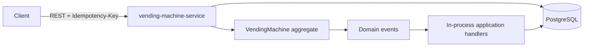

# Vending Machine System Design

This reviewer-facing summary records the accepted case architecture. Product rules are in [`assumptions.md`](assumptions.md); implementation status and run instructions are in the README.

## Requirement traceability

The original case requires DDD, domain events and event handling, a Spring Boot REST API with Swagger, persistence and consistency, monetary validation, error handling, recovery, and the supplied ten-product sample data. It does not require Kafka, an audit service, an outbox, or microservice decomposition.

The solution therefore uses one deployable. Event-driven behavior is transaction-local and in-process; external messaging is added only when a real downstream consumer exists.

## Architecture



| Deployable | Responsibility |
|---|---|
| `vending-machine-service` | Authoritative machines, product availability, sessions, stock, cash, purchases, command results, REST API, recovery, and domain-event handling |

The domain is framework-independent. Spring, HTTP, JPA and JSON models remain outside it.

## Domain boundary

```text
VendingMachine
├── active PurchaseSession → escrow composition
├── Slots → product/price snapshot + stock
└── CashInventory → denomination quantities
```

`VendingMachine` owns every mutation that must remain consistent. A slot contains the sellable product snapshot required by the current case; a separate product lifecycle is not implemented without product-management behavior.

Key invariants:

- one active session per machine;
- only active sessions accept money, selection, or refund;
- stock and cash never become negative;
- refund returns escrow exactly;
- purchase requires stock, balance, and computable exact change;
- failed behavior performs no partial mutation;
- successful behavior completes once.

Sessions transition only from `ACTIVE` to `COMPLETED`, `REFUNDED`, or `EXPIRED`. Money uses immutable `long` minor units; supported denominations are `5`, `10`, `20`, and `50`.

## Event-driven behavior

The aggregate records past-tense domain events without knowing Spring or persistence. Events are released by the application layer after a successful domain mutation and dispatched synchronously inside the use-case transaction.

| Domain event | Current handling |
|---|---|
| `PurchaseCompleted` | An application handler persists the immutable purchase in the same PostgreSQL transaction. |
| `PurchaseSessionStarted` | Identified domain fact; no fabricated downstream side effect is added. |
| `MoneyAccepted` | Identified domain fact; current state is persisted through the aggregate repository. |
| `RefundCompleted` | Identified domain fact; the idempotent command result contains the returned composition. |
| `SessionExpired` | Identified domain fact; recovery persists the terminal aggregate state. |

Only `PurchaseCompleted` needs a separate handler in the current requirements. Adding no-op consumers merely to increase event count is avoided. If an actual external consumer appears, the design must add a transactional outbox and explicit at-least-once/idempotency semantics through an ADR.

## Purchase transaction

```text
provisional cash = machine cash + session escrow
change due       = inserted amount - snapshotted price
change plan      = exact bounded composition
```

The bounded change search minimizes piece count and prefers higher denominations on ties. It computes a complete plan before mutation.

One successful local transaction:

1. atomically claims/rechecks `(machineId, idempotencyKey)`;
2. loads the aggregate with forced optimistic version increment;
3. validates session, stock, balance, and change;
4. mutates stock, escrow, cash, and session;
5. persists aggregate state;
6. dispatches `PurchaseCompleted`; its handler stores the immutable purchase;
7. stores the stable processed-command result;
8. commits before returning product and change.

Currency validation happens through a side-effect-free port before this transaction. Rejection or outage does not mutate domain or processed-command state.

## Reliability layers

| Layer | Mechanism |
|---|---|
| Business consistency | Aggregate invariants and pre-mutation planning |
| Atomicity | PostgreSQL transaction and constraints |
| Concurrency | Root `@Version` + `OPTIMISTIC_FORCE_INCREMENT` for every mutation load |
| HTTP retry | Transactionally claimed processed-command result |
| Event handling | Synchronous in-process dispatcher inside the originating transaction |
| Restart recovery | Persisted session activity + bounded scheduler scan + domain revalidation |

Synchronous handling is deliberate: all current consequences belong to the same local consistency boundary. There is no claim of durable asynchronous delivery because the case defines no external consumer.

## Interfaces and storage

REST v1 exposes product availability, session start/query, money insertion, selection, refund, and purchase lookup. State changes require `Idempotency-Key`; failures use `application/problem+json` with stable codes and correlation IDs.

Core persistence contains machine, slot product snapshots, cash inventory, session tender, immutable purchases, and processed-command results. JPA entities remain in adapters; Flyway owns the schema; PostgreSQL Testcontainers validates migrations and constraints.

The provided ten products are provisioned repeatably for the local case demonstration with positive stock and deterministic initial cash inventory.

## Decisions

| Choice | Reason |
|---|---|
| One authoritative service | Stock, escrow, cash, and purchase need one consistency boundary. |
| PostgreSQL + Flyway | Transactions, constraints, locking, and partial indexes fit the model. |
| Integer money and escrow | Monetary precision and exact-composition refund. |
| Optimistic locking | Same-machine contention should be low; different machines remain parallel. |
| In-process domain events | Meets the stated event-handling need without inventing a distributed consumer. |
| No Kafka/outbox | No external consumer or asynchronous delivery requirement exists in the case. |
| No Saga | Core work commits in one database. |

## Repository

```text
vending-machine-case/
├── .mvn/wrapper/
├── vending-machine-service/
├── docs/{assumptions.md,system-design.md}
├── .dockerignore
├── .env.example
├── .gitattributes
├── .gitignore
├── Dockerfile
├── README.md
├── docker-compose.yml
├── mvnw
├── mvnw.cmd
└── pom.xml
```

Packages are created only for real behavior; no empty placeholders or speculative bounded contexts are added.

## Delivery gates

Implementation proceeds from domain tests to application/API, PostgreSQL consistency, recovery, sample-data provisioning, and an end-to-end demonstration. The canonical build is `./mvnw verify` through Maven Wrapper 3.9.16.

Completion requires atomic purchase, invariant-preserving failures, one effect per duplicate command, child-mutation concurrency protection, restart-safe recovery, Swagger documentation, all supplied products, and a repeatable API demonstration.
